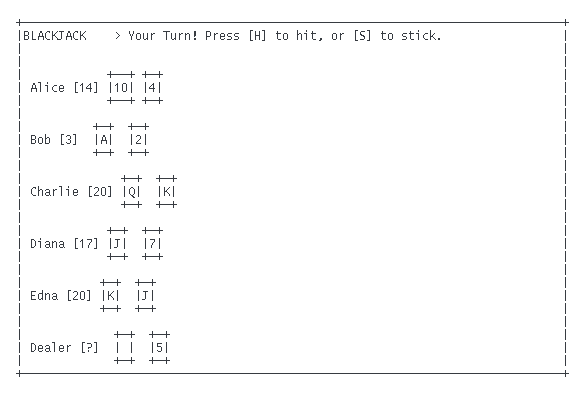
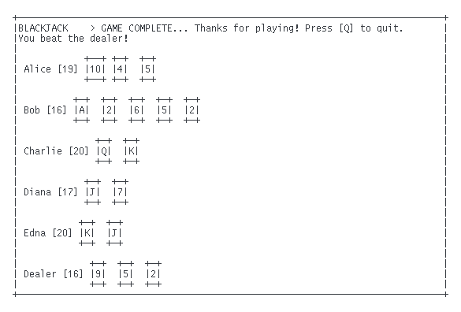

# psc


> A collection of very simple multiplayer turn-based terminal games. 

This *work-in-progress* collection was created for playing multiplayer games either locally on the same machine or remotely via, for example, an [ssh(1)](https://man.openbsd.org/ssh) connection. The text-based graphics and leisurely turn-based gameplay were deliberately chosen to support low bandwidth/latency internet connections.

[UNIX domain sockets](https://en.wikipedia.org/wiki/Unix_domain_socket) are used for communication between the different game instances (running on the same machine).

## Screenshots

#### Blackjack



## Installation

These games are written in C for POSIX-compliant operating systems. Apart from a C compiler, the only other dependency is the [ncurses](https://invisible-island.net/ncurses/#downloads) library. The provided [Makefile](./Makefile) will build all the games in a `bin/` directory in the working directory:

```sh
git clone https://github.com/lewis-weinberger/psc.git
cd psc
make
```

To make an individual game, use `make name-of-game` (substituting `name-of-game` for your desired game).

Build artefacts (compiled object files) will be stored in a `build/` directory. Use `make clean` to remove the compiled executables and object files.

See [INSTALL](./INSTALL.md) for hints on installing for different platforms.

## Usage

Starting each game follows the same pattern. Below we will use `game` to generically refer to any of the game executables (substitute your desired game as appropriate).

To start the host game with `N` other players using socket `/tmp/game_socket`:
```sh
game -h N /tmp/game_socket
```
You can confirm creation of the socket by examining your filesystem (in this example, `ls /tmp` would show the created socket file). The remaining players can then join this game:
```sh
game /tmp/game_socket
```

Each game is turn-based, and will indicate when it is the given player's turn. 

Note that in some of the games, if a client game terminates then the host game will wait until a new player joins to fill their place. If the host game terminates then all the clients will also terminate. If the game is finished normally, the socket will be unlinked, however if the server program is interrupted you will have to manually unlink the socket.

## Writing new games

The collection has been designed in a modular way such that the connections and terminal drawing components can be reused. In particular the game uses very simple (blocking) stream communication between the clients and the server, designed for turn-based gameplay. Alongside this, games employ the ncurses library to display text-based graphics on the terminal.

Documentation describing this functionality is available in the msg(3) and draw(3) manpages. Assuming you have `man` installed, these can be read with:

```sh
man -l msg.3
man -l draw.3
```

Following this documentation and using existing game examples, it should (hopefully) be straightforward to write new games.

### Planned games

The following games are being written for the collection:
- [x] [Blackjack](https://en.wikipedia.org/wiki/Blackjack): 2+ players
- [ ] [Labyrinth](https://en.wikipedia.org/wiki/Labyrinth_(paper-and-pencil_game)): 3+ players
- [ ] [Sternhalma](https://en.wikipedia.org/wiki/Chinese_checkers): 2, 3, 4 or 6 players
- [ ] [Go](https://en.wikipedia.org/wiki/Go_(game)): 2 players
- [ ] [Chess](https://en.wikipedia.org/wiki/Chess): 2 players

See also [this list of abstract strategy games](https://en.wikipedia.org/wiki/List_of_abstract_strategy_games).

## License

[MIT](./LICENSE)
